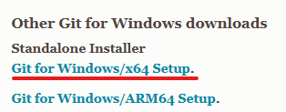
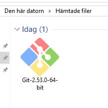
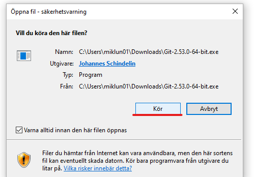
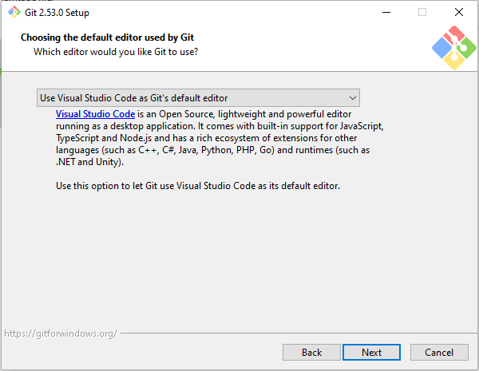
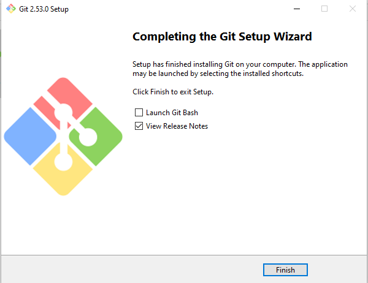
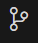
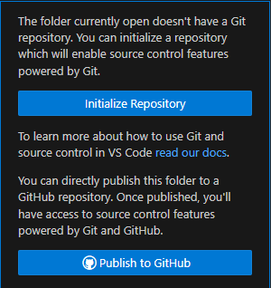
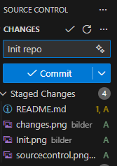
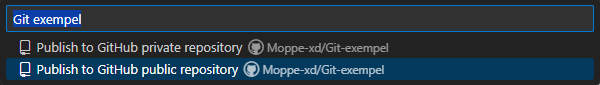

# Git exempel

Denna git repo är ett exempel på hur man använder sig av git och github i VS Code. I denna README så kommer det finnas instruktioner och `commandon` som kommer behövas.

---

## Installera git på datorn

För att kunna använda sig av git och github måste vi först installera git. För att installera git så går du in [här](https://git-scm.com/install/windows). Där kommer du se många olika länkar men ni ska trycka på är den som är understrycken på bilden nedan.

När ni har tryckt på den så kommer en fil laddas ner till datorn och när den är nerladdad så kommer det se ut något nedan. Tryck på git filen för att starta installationen

Du kommer få upp en varningsfönster som ser ut som nedan. Det är inget farligt så att det är bara att trycka på `kör`.

Nu är det bara att klicka dig igenom utan att göra några ändringar fram till du kommer till denna sida. Här är det viktigt att du väljer `Visual Studio Code as Git's default editor`. Git defaultar till en text hanterare som kallas för `Vim` och kan skapa problem om vi väljer den.

När du har valt `Visual Studio Code as Git's default editor` så är det bara att gå vidare genom att klicka next. Nu är du nästan färdig! Tryck dig igenom installationen utan att ändra några inställningar. Du är färdig med att installera git när du ser denna

---

## Skapa ett git projekt

När vi har öppnat vårat projekt i VS Code så kan vi trycka på source control fliken  och trycka på knappen `Initilize project`
.

Därifrån kommer ni få en flik som liknar bilden under.

Tryck sedan på plusset för varje fil du vill lägga till! När du har lagt till alla filer du vill ha så kommer det se ut som bilden nedan. Lägg sedan till ett namn på din commit som förklarar vad för ändringar du har gjort.

Tryck sedan på `commit` knappen och efter lite laddande borde din source control se ut som följande.

Innan vi kan publisera den så måste vi först configruera git med två kommandos

`git config user.name "DittAnvädarnamnHär"`
`git config user.email "DinMailHär"`

När dessa två kommando är gjoda kan du trycka på `publish Branch` knappen. Om du inte redan är inloggad med ditt github konto kommer du bli tillbad att logga in på github. Efter det bör ni få ett val som bilden nedan. Det är viktigt att ni väljer ett `public repo` så jag kan få tillgång till eran kod.

Om det inte blev någon error borde du nu kunna gå in på github och hitta ditt repo i din profil.

---

## Att göra ändringar

Så fort ni gör sparar någon ändring i git-repot så kommer ni merkar hur source kontroll fliken ändras likt bilden nedan. Detta betyder att ni har ändringar ni kan commita till git. I bild exempel nedan betyder siffran 3 att jag har tre stycken ändringar som jag kan `commita` till git.

För att göra det gör vi exakt som vi gjorde i ovanstånde steg och trycker på `+` vid filerna vi vill `commita`. Sedan så skriver vi en besrkivning av vad för förändring vi har gjort och trycker på `commit`

---